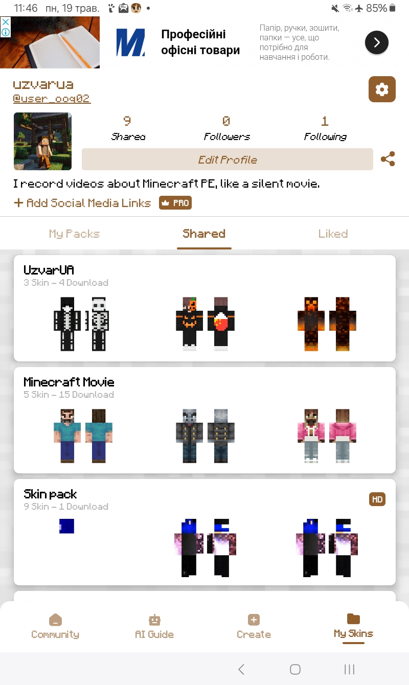

> [!Note]
> Google забрали доступ adb shell (android 15.0+) і папку "Android/data" (android 11.0+)  
> Google забрали доступ "Параметри розробника" (Android 16.0+)  
***
## Зміст
* [Android](#android)
* [Skin Pack Maker for Minecraft](#skin-pack-maker-for-minecraft)
* [Атлас Клієнт](#атлас-кліент)
* [Minecraft Bedrock Edition v1.21.72](#minecraft-bedrock-edition-v12172)
* [ПК](#пк)
***
# Android
> [!Warning]
> Повинен бути архітектура процесора `arm64-v8a`  
> Повинен бути *android 9.0+*  
***
> [!Note]
> Вам потрібно завантажити файл [For_Cape_1.21.4+.zip](https://github.com/uzvarUA/For-Cape-1.21/releases/download/for-cape-1.21/For_Cape_1.21.4+.zip) на пк і на android  
> Вам потрібно встановити [Skin Pack Maker for Minecraft](https://play.google.com/store/apps/details?id=com.nisha.skin_pack_maker_minecraft)  
> Вам потрібно комп'ютер на Windows, щоб зашифрувати файли  
> Вам не потрібно `WIN+R CODE.txt`  
***
## Skin Pack Maker for Minecraft

## Атлас Клієнт
1. Переходимо по `Android/data/net.atlasclient.atlaspe/files/games/com.mojang/skin_packs`
2. У мене папка `UzvarUA` (при створенні свої скіни у `Skin Pack Maker for Minecraft`). Треба копіювати цю папку `UzvarUA` до папки `Download`.
3. У цій папці `UzvarUA видалити все крім файла `manifest.json`
4. Дальше добавлаєш із папки `Pack` до папки `UzvarUA`
5. Дальше створити `UzvarUA.zip`
6. Дальше переходимо до [комп'ютера](#пк)
***
## Minecraft Bedrock Edition v1.21.72
1. Переходимо по `Android/data/com.mojang.minecraftpe/files/games/com.mojang/skin_packs`
2. У мене папка `UzvarUA` (при створенні свої скіни у `Skin Pack Maker for Minecraft`). Треба копіювати цю папку `UzvarUA` до папки `Download`.
3. У цій папці `UzvarUA видалити все крім файла `manifest.json`
4. Дальше добавлаєш із папки `Pack` до папки `UzvarUA`
5. Дальше створити `UzvarUA.zip`
6. Дальше переходимо до [комп'ютера](#пк)
## ПК
Шифруємо файли на комп'ютері.
